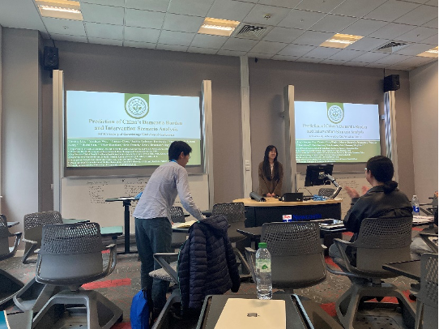

2024年7月1日至2024年7月6日，ELDERS团队的廖婧副教授率领三人团队前往英国纽卡斯尔大学人口健康科学研究所进行学术交流，并参加了第53届英国老年医学年会（53rd Annual Conference of the British Society of Gerontology, BSG）。

<!--more-->

【访问交流议程】
## 7月1日下午

ELDERS团队廖婧副教授一行三人前往纽卡斯尔大学的National Innovation Centre Ageing（NICA），与UK-China Healthy Ageing Project项目团队会面。项目负责人Sarah Nolan详细介绍了该项目的概况和目标，该项目旨在加深中英在健康老龄化领域的合作，连接中英在养老行业、创新技术和研究领域的沟通桥梁。

NICA致力于通过与公民及私人和公共组织的共同创新，推动健康老龄化和长寿的研究与创新。该项目旨在建立一个支持健康长寿和独立生活的生态系统，并通过收集行为和市场数据、分析趋势，放大人类洞察力。NICA在中国的项目旨在了解老年人的生活经验、需求和未满足的需求，确保创新过程以老年人的需求为核心。

在交流讨论中，廖婧副教授介绍了中山大学的历史、公共卫生学院的学科建设以及团队近年来取得的成果。此次交流为未来中英双方在学术研究、技术创新和政策制定等方面的深入合作奠定了基础。通过了解双方项目的具体实施和运营模式，团队寻找到了合作契机，推动了双方在健康老龄化领域的深度合作。

## 7月2日上午
ELDERS团队前往纽卡斯尔大学参加早餐会议研讨。廖婧副教授围绕着中英老龄化健康与社会挑战——老年痴呆疾病负担预测及应对研究汇报了研究成果。孙瑞妮在研讨中介绍了ELDERS团队正在进行的关于社区数字认知训练社会嵌入式实施策略的研究。周榆敬介绍了长期护理保险对失能失智老年人覆盖的影响。会后，双方团队针对中国痴呆负担现状、数据分析方法以及未来研究方向等问题进行了深入探讨。

## 7月3日至7月5日
ELDERS团队在纽卡斯尔大学参加了第53届BSG年会。本届会议主题为“老龄化与生命历程的新方向”，来自世界各地的约400名学者共同探讨了在社会、政治和经济转型背景下老年人的生活变化和未来研究的发展方向。
会议期间，廖婧副教授和孙瑞妮作了题为“中国老年痴呆负担预测和干预情景研究”的报告，并与参会学者就研究方法和局限性进行了深入讨论。周榆敬展示了题为“中国痴呆危险因素人群归因分数”的海报，与与会者进行了广泛交流。
通过此次学术交流与会议参会，团队成员不仅拓宽了学术视野，也为未来的研究工作带来了宝贵的启示和合作机会。

【成员感想】
孙瑞妮：
在BSG会议开幕式中，主办方在老年学科下详细介绍了当地的历史背景，这不仅让我感受到浓厚的人文关怀，也让我充分意识到环境和文化背景对老年人生活的深远影响。结合在几天的学术交流中对方的建议和评价，更是让我深刻反思，未来的研究不仅要更精，即对研究对象有充分深入的了解；还要更广，即关注如何让研究成果产生更大的影响力。
我深刻感受到学术交流的重要性和必要性。尽管某些研究团队获得了口头报告的机会，但他们的研究并不一定特别出色。因此，无论国内外会议都应积极投递论文，自信展示自己的研究内容，争取参会机会。参会不仅是展示我们研究成果的平台，更是开阔视野、学习新知识的宝贵机会。通过这些学术交流，我们可以了解最新的研究动态，借鉴其他团队的研究方法和思路，从而提高我们的科研水平。参会过程中也充分利用机会与同行学者深入交流，建立广泛的人脉网络。这些活动不仅是学术交流的平台，更是建立友谊和未来互助的契机。
此次参会还让我意识到汇报技巧的重要性。即使研究内容具有很高的价值，如果不能清晰、有条理地表达出来，就难以引起听众的兴趣和共鸣。我看到一些演讲者虽然研究内容相对一般，但他们的汇报技巧非常出色，能够有效吸引听众的注意力。因此，多加练习演讲和汇报，提升自己的表达能力，这不仅有助于学术交流，对未来的职业发展也大有裨益。
展望未来，我将继续深入老龄化研究领域，并努力提升自己的科研水平和汇报技巧。我相信，通过不断的学术交流和自身的不断努力，我们的研究必将在国际舞台上绽放光彩，为老龄化研究做出更大的贡献。
 
周榆敬：
本次出访让我感受颇深，通过与深耕于老龄化领域大佬的面对面交流，使我深刻体会到完备学术思维的构建和创新思想的提出需要持之以恒地执着和创新。这种亲身接触不仅拓宽了我的视野，更让我对未来研究方向有了更为清晰地认知。
在参加BSG2024年会上，我有机会了解到世界各地在老龄化研究领域的最新进展。通过海报展示，我不仅听取世界各地同领域的前辈们针对我的研究的建议，还让我了解了全球范围内老年痴呆相关研究进展。通过听取前辈们的口头汇报，我受益匪浅，让我印象深刻的是英国在数据质量和公共卫生数据库管理方面的高标准和政府的高度重视。这种系统化、精确化的数据管理模式对科学研究的推动作用不可小觑。与此同时，我也意识到中国在老年化研究领域还有很大的潜力和发展空间，特别是在数据收集和公共卫生政策支持方面仍有提升的余地。
总体来说，这次出访不仅让我对全球老龄化研究有了更深刻的理解，也激发了我对未来研究的更多思考和期待。
